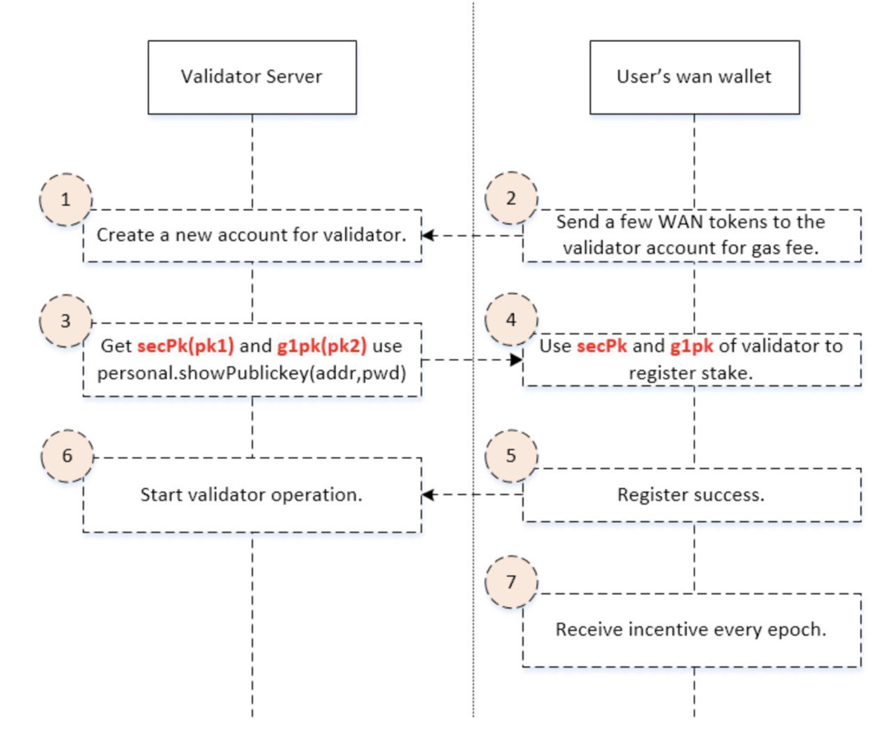

# Mainnet Validator Node Setup
This tutorial will guide you through deploying and running a mainnet validator node on a newly created cloud server.

After the node is started, the validator node registration can be completed by through newest version of the [official light wallet](https://github.com/wanchain/wan-wallet-desktop/releases).

(This tutorial will use the latest docker image to start the node when the node starts. During the run, sudo privileges will be used. If you don't want to use sudo privileges, please see the [manual setup tutorial](staking/manually-deploy-validator.md).

 

## Quickstart Script

After logging in to the cloud server through ssh, run the following command:

```
wget https://raw.githubusercontent.com/wanchain/go-wanchain/develop/loadScript/deployMainnetValidator.sh && chmod +x deployMainnetValidator.sh && ./deployMainnetValidator.sh
```

The script will prompt you to enter the name of the validator, which is used as the display name on the wanstats website.

The script will prompt you to enter the password for the validator account. When you enter the password, not seeing any input on the screen is normal. Press Enter when the input is complete.

The script will prompt you for a second password confirmation.

**Please remember to back up your password properly. If this password is lost, there is no way to recover it**

After the script is executed, the output will show: 

* Validator address
* 2 public keys
* JSON content of the keystore. 

**NOTE: The validator address should not be used as the registration address where staking funds come from. Don't mix up your validator address and your registration address you use to supply the staking funds.**

**Carefully backup all this information!**

This information together with your password is used to restore your node in case of corruption or loss of data, so it is vital that you store it safely.

You can view the work log using the following command:


```
sudo docker logs -f gwan
```

Stop log view by pressing Ctrl-C

If you see the words Validator Start Success, the node has started successfully and chain synchronization is ongoing.

You can view the node information on the [WanStats](https://wanstats.io/) website.

## Fund your validator address 
You must fund your validator address with a small amount of WAN in order to pay for PoS transaction fees. As transactions fees are very small, for example, ~0.005 WAN, 100 WAN should be plenty to get started. 

## Node Registration

You can register your node using the officia [Wan Wallet](https://github.com/wanchain/wan-wallet-desktop/releases).

1. If this is the first time you run a light wallet, you will be prompted to create and back up your mnemonic phrase. Please **properly back up the mnemonic**, as it is the ONLY way to recover your wallet!

1. Transfer the WAN you will be staking to your funding account and wait for the transaction to complete.

1. Follow the registration instructions on the [wallet guide](wallet_and_tools/wan-wallet?id=validator-node-registration).

1. After registering successfully, you can view the validator address just registered in the validator list on the [WanScan](https://wanscan.org/) website. (same as the address backed up above)

1. To update your validator display information on WanScan.org, fill in this [form](https://forms.office.com/Pages/ResponsePage.aspx?id=VPnN3XSIEEqLYwFUDjqIlhDN00eQ8opLu9Rbjur15g5UOTVCNFoxQ0dCRUNFTFQzTTVBVFFVMjI2OS4u)


## Switching Node to a New Server

[See FAQ](staking/faq?id=node-switch)

## Common Operations

For common operations such as restarting, updating, or deleting your node, see the [commonly used scripts section](staking/pos-scripts).
